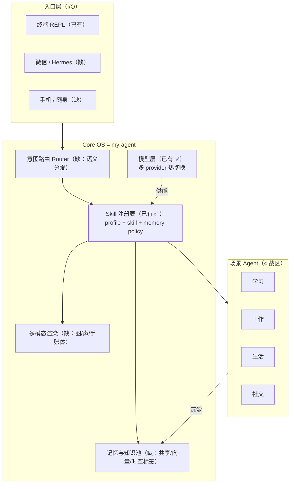

# Personal AI OS — 项目蓝图

> **本文档是什么**：整个 Agent 矩阵的总蓝图（living doc）。它回答两个问题——①我有几个 Agent、各自什么特点；②要不要先做通用基座。每个具体 Agent 落地时，再单独写一份 `docs/superpowers/specs/` spec。
>
> **来源**：2026-06-15，由手稿照片 + 与 Gemini 的对话整理而成。
>
> **设计哲学**（手稿原话）：「agent 不会有脾气，归纳和提醒，顺便更改。」

---

## 0. 一句话愿景

把 `my-agent` 这个 repo 当作**自己的 Personal AI OS（Core OS）**，在其上长出学习 / 工作 / 生活 / 社交四个战区的十几个场景 Agent，所有 Agent 共享同一套：多模态入口、记忆池、Skill 注册表、意图路由。

---

## 1. 核心结论：my-agent 即 Core OS

你不是从零造一个"通用基座"。**你现在这个 repo 已经是 Core OS 了**——11 个包、43 个工具、四层上下文压缩、Skill 加载、teammate / subagent 并发、cron 调度、memory、定时推荐（recommendations）。

所以真正的问题不是"要不要做通用的东西"，而是：

> **基座缺了哪几块，场景 Agent 才能插得进来？**

缺口集中在 **I/O 多模态** 和 **记忆 / 路由** 两层（Skill 层已经成熟）。补上这两块，几乎所有场景 Agent 都能解锁。详见 §4。

---

## 2. 现状盘点：Core OS 四层映射 + 缺口图

| Core OS 层 | 你已有的（来自 repo） | 场景 Agent 需要但**还没有**的缺口 |
|---|---|---|
| **I/O 多模态** | `utils/terminal.py`（纯文本、线程安全）、REPL、`/reco` 命令 | ❌ 图像 / 声音输出 ❌ 非终端入口（微信 Hermes / 手机） ❌ 手账体 / 画报渲染（乱画 → 好看输出） |
| **记忆与知识池** | `.memory/MEMORY.md`（纯文本读入上下文）、`recommendations/`（`.agent/recommendations.json`）、`.tasks/` `.logs/` `.transcripts/` `.mailboxes/` | ❌ 跨 Agent 共享记忆 ❌ 向量检索 / 知识沉淀池 ❌ 时空状态标签（工作日 / 周末 / 节假日 / 出差） |
| **Skill 注册表** | `plugins/skills.py`（加载 `skills/*/SKILL.md`）、`tools/registry.py`（profiles + enable/disable + 热重载）、`agents/profile.py`（soul/skills/tool_profile/memory policy） | ✅ **基本够用**——这是最成熟的一层。场景 Agent ≈ profile + skill 包 + memory policy |
| **路由中枢** | `agent_loop`（LLM 自己选工具）、`tools/dispatch.py` 注册、`tools/executor.py`（ToolExecutor） | ❌ 语义意图路由（一句"今天花 50 吃麦当劳"自动分发给复盘 + 变帅） |
| **模型层（加分项）** | `model_providers.json` + `/model` 热切换 | ⚠️ 本地 ollama 还没配进 providers；多 provider 已就绪 ✅ |

**关键加分项**：`model_providers.json` 的多 provider 热切换意味着「本地 ollama vs API」**架构上已经解决**——只要把 ollama 作为一条 provider 加进去即可，不用改框架。同理，「Mac 跑不动本地模型」是硬件 / 部署问题，不是架构问题。

**第二个加分项**：`tools/registry.py` 里已经有 `butler` / `digital_self` / `automation` 等 profile。这说明你**早就在用 profile 建模场景 Agent**了——蓝图只是把这个做法系统化。

---

## 3. Agent 矩阵（4 战区）

> 状态标记：💡 纯构想 · 🧩 部分实现 · ✅ 已有基础可复用

### 3.1 学习战区

| Agent | 定位 | 输入 → 输出 | 关键能力 | 卡点 | 依赖 Core OS 层 |
|---|---|---|---|---|---|
| **英语 Agent** 💡 | 四六级备考 | 时间段 → 听/读/词/译练习 | 听力沉浸式耳机、发音矫正、每日推送、实体答题卡、随机出题 | 多模态（发音/听力音频）、定时推送 | I/O 多模态、Skill、Cron ✅ |
| **期末/编程学习 Agent** 💡 | 体系化自测 | 知识点 → 出题 + 3h 复盘 | 随机出题系统、复课复盘 | 本地模型（ollama）跑得动 | 模型层（已支持）、记忆 |
| **历史演绎 Agent** 💡 | 对话还原历史 | 对话 → 场景还原 | 角色扮演、选择性记忆 | — | 记忆、Skill |
| **科普 Agent** 💡 | 还原溯源 | 概念 → 本源追溯 | 论文 / 长文检索沉淀 | 浏览器 Agent 抓取 | 记忆池、Skill |

### 3.2 工作战区

| Agent | 定位 | 输入 → 输出 | 关键能力 | 卡点 | 依赖 Core OS 层 |
|---|---|---|---|---|---|
| **每日复盘 Agent** 🧩 | 数据驱动复盘 | 每日数据 → 付款节奏 + 周报 | 消费分析、结构化周报 | 数据源接入 | 记忆池、Cron ✅ |
| **会议 Agent** 💡 | 实时会议辅助 | API 回调 → 建议 | 实时数据处理、决策建议 | **实时性**：不能实时返回；本地模型有延迟 | 模型层、I/O |
| **搭职/指导 Agent** 💡 | 职场导师 | 对话 → 工作总结 + 方向 | 以对话总结工作意义 | — | 记忆、Skill |
| **月报 Agent** 💡 | 周期汇报 | 周/月数据 → 月报 | 配合每日/周复盘形成闭环 | — | 记忆池、Cron ✅ |
| **桌面自动化 Agent** 💡 | 三桌面入口 | 桌面状态 → 自动化操作 | 日常桌面 / 学习桌面 / 工作桌面合一 | RPA 能力、识图 | Skill、RPA Agent |
| *竞品 / 客户 Agent* 💡 | 工作子项 | 竞品/客户数据 → 分析 | 追踪对手、分析客户 | — | 记忆池 |

### 3.3 生活战区

| Agent | 定位 | 输入 → 输出 | 关键能力 | 卡点 | 依赖 Core OS 层 |
|---|---|---|---|---|---|
| **变帅 / 健康 Agent** 💡 | 健康 + 财务管家 | 饮食/花销 → 提醒 + 周报 | 定时提醒喝水、饮食记录、每周报告（花销 + 摄入）、更深知识推送 | **最特殊**：云端 + 本地双端；需区分工作日 / 周末 / 节假日；周末不开电脑也要能用 → 走 Hermes/微信 | I/O（微信入口）、记忆池（双端同步）、时空状态 |
| **管家 Agent** 💡 | 终极保姆级 | 全局 → 主动归纳提醒 | 目标"完全不用顾问" | 几乎依赖所有层 | 全部 |
| **定时提醒 / 支持 Agent** ✅ | 定时推送 | 时间 / 数据 → 推送卡片 | 提醒喝水、知识理解推送 | **已被 `recommendations/` 部分实现** ✅ | recommendations ✅、Cron ✅ |

### 3.4 社交战区

| Agent | 定位 | 输入 → 输出 | 关键能力 | 卡点 | 依赖 Core OS 层 |
|---|---|---|---|---|---|
| **数字分身 Agent** 💡 | 微信群运营 | 提问 → 高转化话术 | RPA + 识图、联动知识库、维护微信群 | RPA、识图、知识库联动 | Skill、记忆池、RPA |
| **人情世故 Agent** 💡 | 情商教练 | 录音 → 复盘批评 + 话术 | 先给录音再批评、三维度（家/社会/职场） | 语音处理、记忆（寻找共鸣） | I/O 多模态（音频）、记忆 |

### 3.5 横切 / 支撑型 Agent（服务于所有战区）

| Agent | 定位 | 卡点 |
|---|---|---|
| **浏览器 Agent** 💡 | 抓 X/Reddit/论文/长文 → 沉淀到知识库 | 可复用浏览器自动化方案 |
| **RPA Agent** 💡 | 自建 RPA，给数字分身 / 桌面自动化用 | Mac 适配 |
| **漫谈 / 闲聊 Agent** 💡 | 无目的陪伴 / 脑暴 / 倾听 | — |
| **AIGC 创作 Agent** 💡 | 生图 / 生视频 / 漫剧（初学者引导版） | 多模态生成 |
| **B 站 Agent** 💡 | 保留语言腔调、多风格 | 风格控制 |

---

## 4. 通用底层架构（要补强的 Core OS）

### 每层「现状 vs 目标」

- **I/O 多模态**（缺口最大，优先级最高）
  - 现状：纯文本终端。
  - 目标：终端内能输出图 / 发声；新增微信 Hermes 与手机入口；乱画草图 → 手账体画报。
  - 这是用户体验差距的主因，也直接卡住英语（音频）、人情世故（录音）、变帅（手机推送）。

- **记忆与知识池**
  - 现状：`MEMORY.md` 纯文本 + 各 `.json` 状态文件，Agent 之间不共享。
  - 目标：跨 Agent 共享记忆 + 向量检索（沉淀推特/Reddit/论文/长文）+ 时空状态标签（工作日/周末/节假日），让变帅 Agent 知道"周末别推桌面任务"。

- **Skill 注册表** ✅
  - 已成熟。场景 Agent 的落地形态 = 一个 profile（`tools/registry.py`）+ 一组 skill（`skills/`）+ memory policy（`agents/profile.py`）。

- **意图路由 Router**
  - 现状：靠 LLM 在 `agent_loop` 里自己选工具，无跨 Agent 语义分发。
  - 目标：一句话能同时触发多个 Agent（"今天花 50 吃麦当劳" → 复盘记账 + 变帅算卡路里）。

- **模型层** ✅（架构已就绪）
  - 多 provider 热切换已支持；补一条 ollama provider 即可解决"本地模型"诉求。

---

## 5. 分阶段路线图（base-first）

> 驱动原则：**先筑牢通用基座**。先补 Core OS 缺口，再滚动接入场景 Agent。

| Phase | 目标 | 产出 | 依赖 |
|---|---|---|---|
| **0. 蓝图成文** | 把愿景落定（本文件） | `docs/PROJECT_BLUEPRINT.md` | — ✅ |
| **1. 通用基座补强** | 补 I/O 多模态 + 共享记忆 + 意图路由 | 多模态输出 POC、共享记忆层、Router 原型、ollama provider 接入 | 本蓝图 |
| **2. 第一个场景 Agent 插入** | 用真实场景验证基座 | 选 1 个：**每日复盘**（复用已有数据）或 **变帅**（最特殊、最能压测双端+微信+时空状态） | Phase 1 |
| **3. 滚动接入** | 其余 Agent 逐个 spec → plan → impl | 每个 Agent 一份 `docs/superpowers/specs/` | Phase 2 验证通过 |

**为什么 Phase 2 推荐每日复盘或变帅**：每日复盘数据源现成、能最快形成"每天用"的反馈闭环；变帅最特殊（双端 + 微信 + 时空标签），压它能逼出基座所有缺口，一次验证全部层。

---

## 6. 关键决策 & 开放问题

| # | 议题 | 选项 | 现状倾向 |
|---|---|---|---|
| 1 | **统一入口**：微信 Hermes vs 终端 vs 手机 | Hermes 作统一聊天界面，覆盖"周末不开电脑"场景 | 待定（变帅 Agent 强需求） |
| 2 | **本地模型 vs API** | ollama 本地 vs 云端 API | 架构已支持多 provider；硬件适配（Mac）是瓶颈 |
| 3 | **终端多模态**：图 / 声怎么出 | iTerm2 图形协议 / 外部图片查看器 / TTS | 待调研 |
| 4 | **云端 vs 本地数据** | 变帅需双端同步，数据有风险 | 待定（涉及隐私 + 同步方案） |
| 5 | **时空状态建模** | 工作日 / 周末 / 节假日 / 出差 如何全局标记 | 待设计（放进记忆层） |
| 6 | **副业模式** | 留公司 + 一个 Agent 运作副业（工作台：自己 Agent + CC + 1CC） | 待拆 |
| 7 | **内容沉淀去向** | 博客 + 多维表格（参考李佳芮）而非公众号 | 已定方向 |

---

## 附录 A：手稿中未被收进矩阵的点（备忘）

- 聊天记录导出、`create_agent` 辅助工具
- "从 skill 到 agent"的主动加载推送（动态挂载技能）
- 节点可点击 → 自动发送深入问题；底部"生成行动计划"按钮（按优先级整合所有方向）
- 卡点备忘：Mac 下 ollama 本地模型跑不起来（硬件适配）

## 附录 B：术语对照

- **Core OS** = `my-agent` repo 本身（11 包 / 43 工具）。
- **场景 Agent** = profile + skill 包 + memory policy 的组合，跑在 Core OS 上。
- **Hermes** = 接近微信的交互通道，拟作统一入口。
- **CC / 1CC** = 工作台中"自己的 Agent + Claude Code"协作栈（手稿原记）。
